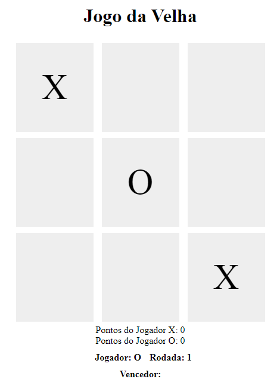
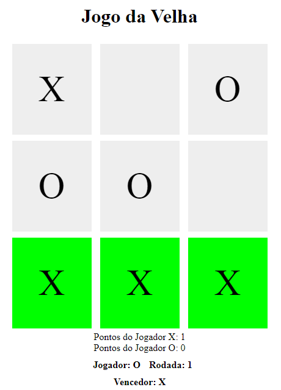

# Tic Tac Toe Game
Pequena modificação do código apresentado no Lab **"Criando seu próprio jogo da velha..."** da [Digital Innovation One](https://digitalinnovation.one).

## Modificações
Foi adicionado o placar de cada jogador, assim como o número da rodada atual.

## Instruções
Para iniciar o jogo, abra o `index.html` no seu navegador da web.
O 'X' e o 'O' são marcados pelo próprio jogador. Não há suporte para partidas contra o computador.

## Tecnologias utilizadas
- HTML
- CSS
- Javascript

## Screenshots

